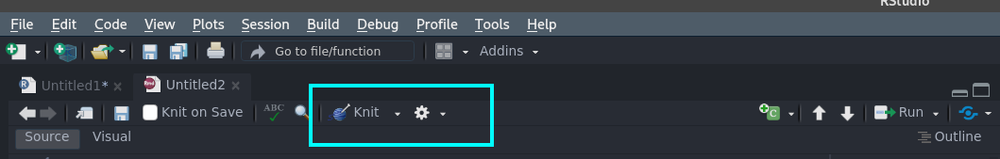

```{r results='hide', message=FALSE, warning=FALSE, include=FALSE}
library(knitr)
opts_chunk$set(
  fig.width = 4 * 0.9,
  fig.height = 3 * .9,
  fig.align = 'center',
  warning = FALSE,
  message = FALSE)
```

# Para usar esta plantilla:

1. Instalar `tinytex` usando `install.packages('tinytex')`. En el siguiente chunk de R se muestra cómo.


```{r instalar, eval = FALSE}
# eval = FALSE evita que las siguientes líneas sean evaluadas
install.packages('tinytex')
tinytex::install_tinytex()
```

2. Los documentos en RMarkdown se ajustan a la sintaxis de Markdown. La sintaxis básica de Markdown se puede consultar en internet. Por ejemplo, [en esta liga](https://www.markdownguide.org/basic-syntax/).

3. Los documentos se pueden renderizar (convertir en PDF) usando `Ctrl+Shift+K` (en RStudio) o haciendo click en el botón de Knit en RStudio 

```{r, echo=FALSE,fig.align='center',out.width = '70%', fig.cap = "Renderizar documento con Knitr"}

```

4. El código de `R` se coloca en _chunks_ de código, como el primero en donde se describe cómo installar `tinytex`. Comienzan con tres acentos graves ( backticks ` ). Por ejemplo

```{r, summary-stats}
x <- 1:10 
y <- 10:1 
dataf <- data.frame(x = x, y = y)

summary(dataf)
```

Si se desea que el código sea evaluado _pero no se imprima el chunk_ en el documento, se debe agregar `echo=FALSE` entre las llaves. Lo siguiente 

```
{r, summary-stats, echo=FALSE}
x <- 1:10 
y <- 10:1 
dataf <- data.frame(x = x, y = y)

summary(dataf)
```

imprimirá únicamente el resultado de la evaluación:

```{r summary-stats2, echo=FALSE}
x <- 1:10 
y <- 10:1 
dataf <- data.frame(x = x, y = y)

summary(dataf)
```

Los gráficos se añaden de la misma manera:

```{r, simple-plot}
x <- 1:10 
y <- 10:1 
dataf <- data.frame(x = x, y = y)
plot(dataf$x, dataf$y, xlab = "x axis", ylab = "y axis")
```

Parámetros adicionales se pueden añadir al chunk para modificar la forma en que se muestra el gráfico. Por ejemplo, para que se muestre un gráfico centrado y con determinadas dimensiones, se usa 


```{r, simple-plot2, fig.width=4, fig.height=3, fig.align='center'}
x <- 1:10 
y <- 10:1 
dataf <- data.frame(x = x, y = y)
plot(dataf$x, dataf$y, xlab = "x axis", ylab = "y axis")
```

Las leyendas se añaden con el parámetro `fig.cap="Leyenda"`

```{r, simple-plot3, fig.width=4, fig.height=3, fig.align='center', fig.cap="Escribir una leyenda apropiada al gráfico. Por ejemplo La relación entre $x$ y $y$ es lineal "}
x <- 1:10 
y <- 10:1 
dataf <- data.frame(x = x, y = y)
plot(dataf$x, dataf$y, xlab = "x axis", ylab = "y axis")
```

El chunk del último ejemplo se vería así 

`{r, simple-plot3, fig.width=4, fig.height=3, fig.align='center', fig.cap="Escribir una leyenda apropiada al gráfico. Por ejemplo La relación entre $x$ y $y$ es lineal"}`

5. Matemáticas con sintaxis de \LaTeX  es bastante sencillo:

- Para ecuaciones _in-line_ se usan símbolos de peso. La ecuación `$f(x)=x$` se verá así $f(x)=x$. 
- Para ecuaciones centradas se usa doble símbolo de peso. La ecuación `$$f(x)=x^2$$` se verá así 

$$
  f(x) = x^2
$$

Ejemplos: 

- Fracciones: `$\frac{abc}{xyz}$` se ve así $\frac{abc}{xyz}$.
- Potencia (exponentes): `$a^2$` se ve así $a^2$, y `$e^{k\lambda}$` se ve $e^{k\lambda}$.
- Índices: `$x_i$` se ve $x_i$, y `$x_{ij}$` así $x_{ij}$. Para dos subíndices debe colocarlse llaves.
- Sumatorias: `$\sum_{i=1}^n$` se ve así $\sum_{i=1}^n$.
- Negritas: `$\mathbf{x}$` se ve así $\mathbf{x}$. 
- Letras griegas: con su nombre en inglés, se indican con diagonal. Por ejemplo, alfa se escribe `$\alpha$` y se ve así $\alpha$; lambda `$\lambda$` y se ve $\lambda$, etc. 

# Otros recursos 

Una lista más detallada de los símbolos que se pueden usar en \LaTeX se puede ver [aquí](https://www.caam.rice.edu/~heinken/latex/symbols.pdf).

Para mayor información sobre RMarkdown consultar [esta lección](https://rmarkdown.rstudio.com/lesson-1.html).